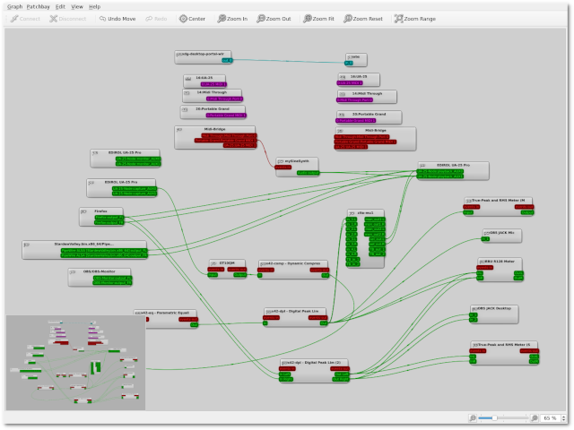

# qpwgraph - A PipeWire Graph Qt GUI Interface

  **qpwgraph** is a graph manager dedicated to [PipeWire](https://pipewire.org),
  using the [Qt C++ framework](https://qt.io), based and pretty much like the
  same of [QjackCtl](https://qjackctl.sourceforge.io).

  Source code repository: https://gitlab.freedesktop.org/rncbc/qpwgraph

  Upstream author: Rui Nuno Capela <rncbc@rncbc.org>.

## Prerequisites

  **qpwgraph** software prerequisites for building are a C++20 compiler
  (_g++_), the [Qt C++ framework](https://qt.io) (_qt6-qtbase-devel_ or
  _qt5-qtbase-devel_) and of course the [PipeWire API](https://pipewire.org)
  C development libraries and headers (_pipewire-devel_).

  Optionally on build configure time, [ALSA](https://www.alsa-project.org)
  development libraries and headers (_alsa-devel_) are also required if
  ALSA MIDI (Sequencer) support is desired (`cmake -DCONFIG_ALSA_MIDI=[1|ON]`...).

## Building

  **qpwgraph** uses the [CMake](https://cmake.org) build system, version
  3.15 or newer.

  On the source distribution top directory:

    cmake [-DCMAKE_INSTALL_PREFIX=<prefix>] -B build
    cmake --build build [--parallel <Njobs>]

  After successful build you may test run it immediately as follows:

    build/src/qpwgraph

  If you may install it permanently, then run, optionally as root:

    [sudo] cmake --install build

  Note that the default installation path (\<_prefix_\>) is `/usr/local` .

  Enjoy.

## Documentation

  * [User Manual](docs/qpwgraph-user_manual.md)
  * [How To Use The Patchbay](docs/qpwgraph_patchbay-user_manual.md)

## License

  **qpwgraph** is free, open-source software, distributed under the terms of
  the GNU General Public License ([GPL](https://www.gnu.org/copyleft/gpl.html))
  version 2 or later.

## Copyright

  Copyright (C) 2021-2025, rncbc aka Rui Nuno Capela. All rights reserved.

